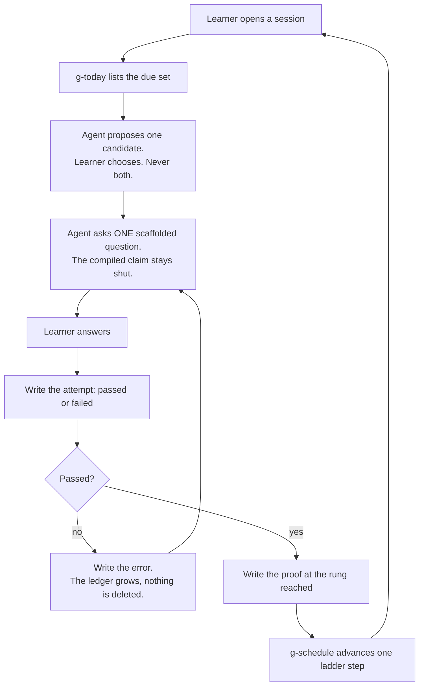
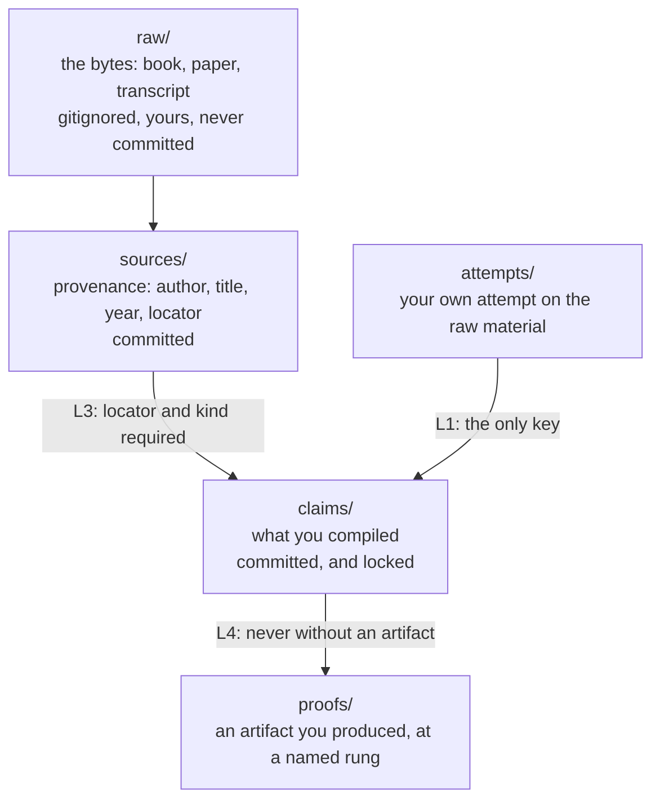
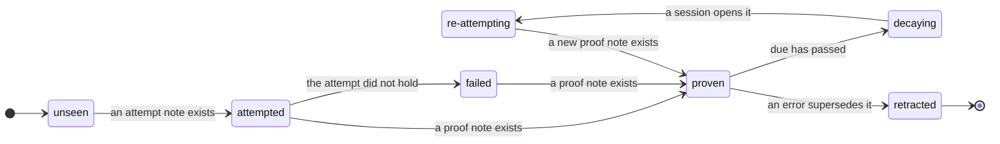
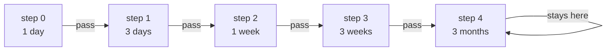
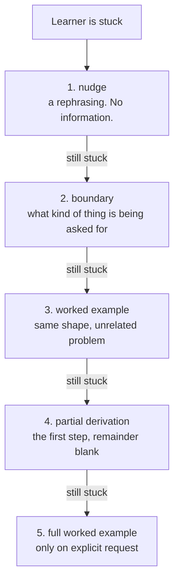

<h1 align="center">Offset</h1>

<p align="center">
  <picture>
    <source media="(prefers-color-scheme: dark)" srcset=".github/assets/banner-dark.png?v=db024032">
    
  </picture>
</p>

<p align="center">
  <picture><source media="(prefers-color-scheme: dark)" srcset=".github/assets/badges/license-dark.svg"></picture>
  <picture><source media="(prefers-color-scheme: dark)" srcset=".github/assets/badges/runtime-dark.svg"></picture>
  <picture><source media="(prefers-color-scheme: dark)" srcset=".github/assets/badges/dependencies-dark.svg"></picture>
  <picture><source media="(prefers-color-scheme: dark)" srcset=".github/assets/badges/laws-enforced-dark.svg"></picture>
  <picture><source media="(prefers-color-scheme: dark)" srcset=".github/assets/badges/deletion-test-dark.svg"></picture>
</p>

<p align="center">
  <a href="#what-it-refuses">Refusals</a> ·
  <a href="#the-evidence">Evidence</a> ·
  <a href="#run-it">Run it</a> ·
  <a href="#reference">Reference</a> ·
  <a href="CITATIONS.md">Citations</a> ·
  <a href="CONTRIBUTING.md">Contribute</a>
</p>

<br>

> **An AI that removes all cognitive effort is the cognitive equivalent of
> sitting on the couch.**

You cannot show that you know something you have never tried to recall and
failed to recall. Everything below follows from refusing to skip that step.

This exists because reading to have read books trains nothing. It is different
because its rules are lint rules rather than prompts. It refuses to show you a
compiled claim before you have produced your own attempt at the raw material.

> [!TIP]
> Clone it, run `bin/g-lint --repo-root . --deletion-test`, and watch a
> repository delete its own software and still pass. That command is the whole
> philosophy.

---

## What it refuses

Seven refusals. Each is enforced by a rule that fails the build, so none of them
depends on the model's attention holding out.

| Refusal | Rule |
|---|---|
| A compiled claim you have not attempted yet | `L1` |
| A summary as your first contact with the material | `L2` |
| A claim with no source, locator, and kind | `L3` |
| `proven` with no proof artifact, or a milestone without `transfer` | `L4` |
| An erased error. `resolution: erased` is not a legal value | `L5` |
| A `proven` claim left past its due date | `L6` |
| A citation that does not resolve, or one graded `DO-NOT-CLAIM` | `L12` |

A law that is not mechanically enforced is a suggestion wearing a suit. Every row
above is a test you can fail on purpose.

`L11` rejects the entire vault if a field named `score`, `streak`, `points`,
`xp`, `level` or `rank` ever appears. We hold **no empirical claim** that streaks
work or fail, and `streaks_evidence` is graded `DO-NOT-CLAIM` for that reason.
The prohibition is philosophical: a streak counter manufactures the *feeling* of
progress, which is the failure this project exists to refuse.

## The loop

A session, exactly as `AGENTS.md` specifies it.



Two things carry the weight. The agent never reads the compiled claim aloud,
only that it exists. And it asks one question, then stops and waits.

`g-today` is **pull-only**. It never notifies, never schedules, and writes
nothing but `today.md`. If you open a task and the agent wants to mention
something overdue, the required sentence is: *"That's due, but not now. You
opened a task. Say the word and I'll pick it up after."* Cognitive activity
about a previous task persists while you work on the next one, and a proactive
tutor is a machine for manufacturing exactly that.

<details>
<summary><samp>Three layers</samp></summary>



`raw/` holds the bytes and is the only thing this repository refuses to track; a
`README.md` inside it is the one exception, because that file is ours rather than
the source's. `sources/` holds a provenance record, so **you commit the
coordinates, not the content**, which is what makes a well-sourced vault a legal
public repository. `claims/` holds what you compiled, gated behind your attempt:
the adaptation of the three-layer pattern from [cite: karpathy_llmwiki].

Your own prior reasoning lives in `self/`, and is **not** gitignored. A
directory marked ephemeral would mean the system had failed at the only thing it
promised.

</details>

## The evidence

The limits, stated before the features, because a system that lists only
strengths is advertising.

### The tutoring ceiling is lower than the field admits

The standard belief is that human tutoring reaches **d = 2.0** over no tutoring.
A careful review found **d = 0.79**, with intelligent tutoring systems at 0.76,
nearly identical, both far below belief [cite: vanlehn2011]. This system does not
promise the 2-sigma result, because a careful review says it was never real.

### Socratic prompting alone is not enough

The strongest evidence that a well-designed AI tutor can beat good human-led
active learning is real: N = 233, effect size 0.63 to 1.3, p < 10⁻⁸
[cite: kestin2025]. But the authors' own scope limitation is that they do *not*
claim it wins for *"complex synthesis of multiple concepts and higher-order
critical thinking"*, and that excluded case is roughly what this system is for.
It is also an **immediate** post-test, not a delayed retention test.

### The same tooling, differently designed, does measurable harm

A preregistered RCT in *PNAS* with around 1,000 high-school students: students
with an unguarded ChatGPT-style tutor scored **+48%** on assisted practice, then
**−17% on an unaided exam, worse than students who never had it at all.** The
same model, rebuilt to withhold answers, lost the harm entirely
[cite: bastani2025]. Note what that paper does *not* say: the guarded version
stopped the damage, it did not produce a benefit.

Those two results are **not** in conflict, and saying so is most of what is new
here. One measures an immediate post-test under a supported scaffold, the other
measures a later unaided exam without guardrails. Different measurements,
different designs. A vendor quoting the first and ignoring the second is telling
you something.

### Self-report is not an instrument

Predictions of your own performance were *uncorrelated* with actual performance
[cite: karpicke2008]; perceived learning from active learning ran *opposite* to
actual gain [cite: deslauriers2019]; and students systematically over-estimated
what an AI tutor had done for them [cite: bastani2025]. Hence artifacts rather
than self-report. Every tick needs a file you wrote.

### What works, and what the popular summaries get wrong

The definitive review rated only **two** techniques *high* utility: practice
testing and spaced practice. Summarization, highlighting, rereading, keyword
mnemonics and imagery were *low*, and elaborative interrogation,
self-explanation and interleaving only *moderate* [cite: dunlosky2013]. Popular
summaries of that paper routinely list the moderate three as winners. This system
builds on the two highs.

Retrieval is uniquely important, but "restudy is useless" is not. Repeated study
after a successful recall produced no measurable learning a week later
[cite: karpicke2008], but a replication showed the between-subjects design
confounded spacing, and that when spacing is controlled, restudying helps too
[cite: soderstrom2015]. We cite the paper that weakens our own headline.

### Exercise, attention, and "brain rot"

The exercise effect is real and modest, and it takes weeks. An umbrella review
across 133 reviews, 2,700+ RCTs and 250,000+ participants found general
cognition SMD 0.42, falling to d = 0.31 after funnel-plot adjustment
[cite: bjsm2025]. A more conservative meta-analysis finds executive function at
g = 0.123 [cite: chang2012]. The dose is **13 to 24 weeks, 20 to 60 minutes, 3
to 7 days a week** [cite: ye2024], from adults 45 and over, so do not quietly
generalise it to a 25-year-old. As we train our body we train our brain
[cite: hillman2008]. Anyone promising faster is selling something.

The attention mechanism is real; the popular numbers are not. Residue from a
previous task persists while you work on the next, and what predicts a clean
switch is *disengaging before you switch* rather than finishing the task
[cite: leroy2009]. But the classic laboratory switch-cost magnitudes are
substantially inflated: in a controlled design the cue-repetition effect
accounted for nearly two-thirds of the measured cost [cite: wiradhany2021]. And
**self-initiated** switching has been shown to *reduce* depletion and increase
focus [cite: nuhn2026], so the no-interruption rule here is about uninvited
residue, not a ban on thinking across two things.

"Brain rot" is a perception, not a diagnosis. It was Oxford Word of the Year
2024, defined by the OED as a *"perceived"* loss of critical thinking *attributed
to* unchallenging content. OUP's own entry records the scientific position:
there is no evidence that brains actually deteriorate as a direct result.
Merriam-Webster's slang entry notes it is not an official medical condition
[cite: oed2024]. The subjective experience is real and worth taking seriously.
The neurological claim is not made here.

The word is older than the internet. Thoreau, *Walden*, 1854: *"will not any
endeavor to cure the brain-rot, which prevails so much more widely and fatally?"*
[cite: thoreau1854] His complaint was the devaluation of complex thought, a
society trading interpretable work for simple content.

**The rot is the rot of the grimoire.**

The 2025 cognitive-debt EEG study behind a lot of "AI damages your brain" posts
is an **arXiv preprint**, not peer reviewed, and it concerns one essay-writing
task [cite: kosmyna2025]. The 2026 finding that AI assistance reduces persistence
and later unaided performance is real and well corroborated, but the paper
usually cited for it is misattributed, so we cite the ones we could actually
verify [cite: liu2026]. The full grading is in [`CITATIONS.md`](CITATIONS.md).

## Run it

```sh
git clone https://github.com/moayedellah/offset.git ~/offset
cd ~/offset
```

Everything in `bin/` is optional. The vault works with none of it, forever. The
checks are cheap, though, and they are the only reason the rules mean anything.

```sh
sh tests/harness.sh                    # 35 assertions, the portable date core
sh tests/lint-tests.sh                 # 24 cases, one per rule, both directions
bin/g-lint --templates templates       # templates are schema-valid
bin/g-lint --repo-root . --deletion-test
```

Point your agent at the vault root. `AGENTS.md` is the canonical instruction
file, and every harness either finds it or has a shim for it: `CLAUDE.md`,
`GEMINI.md` and `QWEN.md` each contain exactly one line, `@AGENTS.md`, because
those tools do not read `AGENTS.md` themselves [cite: agents_md_standard].

> [!NOTE]
> The last command copies each example vault, deletes every non-markdown file by
> construction, re-lints, and fails if the result is not clean. It is the only
> test in the repository that proves the thesis rather than the code.

### The ten-minute path

`examples/book/` is a complete worked subject: Darwin, *On the Origin of
Species* (1859), public domain. Six claims, six attempts, seven proofs across
all three rungs, three errors, two predictions, three insights and two
practices.

1. Open `examples/book/claims/darwin/natural-selection.md`. It is `proven` at
   `transfer`, the top rung, backed by `proofs/darwin/pr-ns-transfer.md`. Now
   read `examples/book/attempts/darwin/att-ns.md`, the **failed** attempt dated
   2026-08-12 that unlocked it. The ordering is the product: the attempt is
   dated before the reading.
2. `examples/book/claims/darwin/variation-passes-directly.md` is `retracted`. It
   is still on disk. Read `errors/darwin/err-vpd.md`, which points at it. The
   claim was wrong, the correction is recorded, and neither was deleted.
3. `examples/decision/TODO.md` lists the five facts **only you can supply**.
   They are missing on purpose, and the example says so rather than inventing
   them.

## Reference

### The five laws

| Law | Rule | What it prevents |
|---|---|---|
| **1. The Closed Book** | `L1` | a compiled claim visible before you attempted it. `unlocked_by` is the only key. |
| **2. No summary as first contact** | `L2` | a `source` note that is only a summary of the raw material |
| **3. Provenance** | `L3` | a compiled claim with no `source`, `locator` or `kind` |
| **4. Exposure is not mastery** | `L4`, `L6` | `proven` with no proof artifact, or a milestone without `transfer` |
| **5. The Ledger** | `L5` | `resolution: erased`, which is not a legal value and never will be |

A proof earns a claim at one of three rungs, and only the last can earn a
subject milestone: `recall` reproduces it, `derive` reproduces the reasoning,
`transfer` solves a problem the source never solved.

### The state machine

Every claim moves through seven states, and every transition needs evidence.



`retracted` is terminal on purpose. A claim that was wrong stays on disk with
the correction attached. The failure this whole project is built against is the
quiet edit, and you cannot audit a record you are allowed to rewrite.

### The scheduler

A fixed, transparent ladder. A pass advances one step, a lapse retreats one.



**This is not FSRS, and it is not better than FSRS.** FSRS is a trainable DSR
model with a power-law forgetting curve, and it genuinely schedules better. Its
per-item state is roughly ten fields including floating-point stability and
difficulty, and the only precedent we found for that shape in YAML frontmatter
was inside an Obsidian plugin, which would make a plugin the owner of your state
and break the Deletion Test.

We chose legibility. A hand-rolled ladder's output is a fact you can verify by
reading a table, and when it behaves oddly you can work out whether it is wrong.
If you want FSRS, the swap is contained: keep the six fields, add float
precision, replace one lookup in `bin/g-schedule`. **That reversibility is the
whole reason the state is kept small.**

<details>
<summary><samp>The Hint Ladder</samp></summary>



Rung 3 is the strongest rung, not the weakest: it transfers the method and leaks
nothing about your particular problem.

Rung 5 has to exist, and the agent must be able to give it. Refusing forever is
not integrity, it is obstruction, and obstruction is its own kind of dishonesty.
**Friction is not the absence of guidance.** The Closed Book is the friction, the
ladder is the guidance, and the ladder's top rung is a worked example, which is
the thing the worked-example effect found works [cite: kirschner2006].

The two counted columns in the attention log are there because the mechanism is
real [cite: leroy2009] [cite: liefooghe2008]. The audit that reads that log back
reports **frequencies** and never grades. *"Tuesday: 47 switches, 31 under 90
seconds"* is a fact. *"Focus score 62%"* is a lie with a chart on it.

</details>

### Layout

```text
offset/
├── AGENTS.md              canonical agent instructions, under 32 KiB
├── CLAUDE.md              @AGENTS.md
├── GEMINI.md              @AGENTS.md
├── QWEN.md                @AGENTS.md
├── CITATIONS.md           the graded evidence ledger
├── README.md              this document
├── rules/                 precedence, five laws, disciplines, contract,
│                          ontology, scheduler, voice
├── bin/                   lib.sh, g-lint, g-new, g-schedule, g-today
├── templates/             one lint-clean template per note type
├── examples/
│   ├── book/              Darwin, complete and lint-clean
│   └── decision/          your own facts, deliberately absent
└── docs/                  philosophy, mechanics, decisions, deletion test
```

Ten note types, each with a lint-clean template: `subject`, `source`, `claim`,
`proof`, `attempt`, `error`, `prediction`, `insight`, `practice`, `audit`. The
schema stays neutral even though the agent talks in sets and reps, because a few
hundred lines of POSIX `sh` has to parse every note in the vault, and a vault of
`type: rep` files is a gym log.

### Adding a law

Three edits, and the third is the one people skip.

1. Write it in `rules/01-five-laws.md`, naming the lint rule that will enforce
   it.
2. Implement it in `bin/g-lint`, **and route it in `lint_vault()`**. The
   dispatch `case` is the single place a rule can be implemented and then
   silently never called.
3. Add an isolation test to `tests/lint-tests.sh` that breaks exactly one thing
   and asserts only that rule fires.

Step 2 is not hypothetical. `L4` sat unenforced for practices for the life of
this project, and the test fixture was carrying the exact violation that hid it.
A rule that is written but never dispatched is worse than no rule, because it
looks like enforcement.

## Contribute

Read [`CONTRIBUTING.md`](CONTRIBUTING.md) and
[`CODE_OF_CONDUCT.md`](CODE_OF_CONDUCT.md). The short version: if you add a law,
add its lint rule **and** a test that asserts only that rule fires. If you add
a citation, add a graded entry to [`CITATIONS.md`](CITATIONS.md) first; `L12`
tells you if you forgot. Security reports go through [`SECURITY.md`](SECURITY.md),
not a public issue.

Built by [**Moayed Ellah**](https://github.com/moayedellah) (`moayedellah`).

MIT, deliberately and with no strings. The point is that this outlives its
software. See [`LICENSE`](LICENSE).
