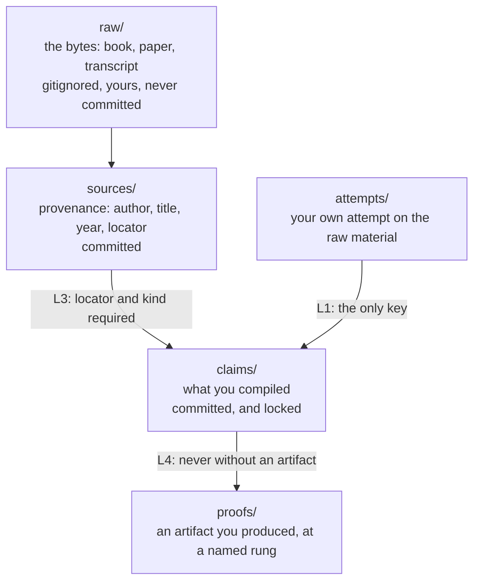
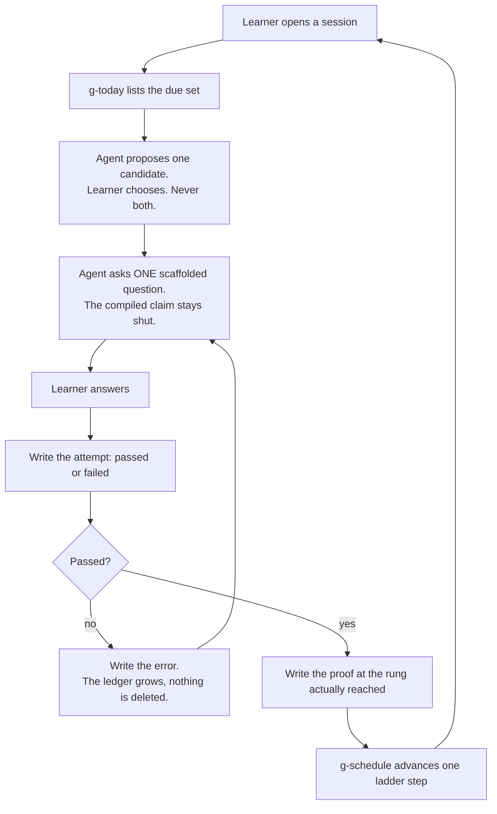
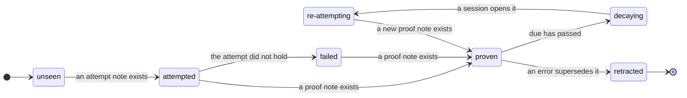
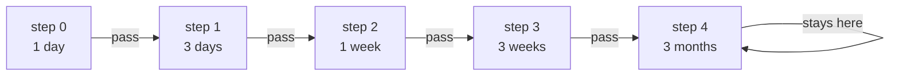
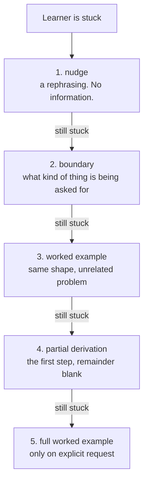
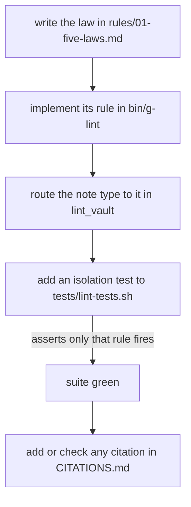

# Offset

**A learning system where the rules are lint rules.** Your notes are the artifact;
nothing else is.

You do not read to have read books. You read to train the reading brain. The same
law governs the vault and the operator, and its corollary is the whole product:

> **An AI that removes all cognitive effort is the cognitive equivalent of
> sitting on the couch.**

So this system refuses to be helpful on demand, and then it proves it. Twelve
lint rules fail the build when you break your own laws. No runtime, no
dependencies, no database. The only executable is a language model reading text.

Start with [what it cannot do](#2-what-this-system-cannot-do). The limits are
stated before the features, because a system that only lists strengths is
advertising.

---

## Contents

| | |
|---|---|
| **The argument** | |
| [1. The problem](#1-the-problem) | the gap this lives in |
| [2. What this cannot do](#2-what-this-system-cannot-do) | the limits, first |
| **The mechanism** | |
| [3. Three layers](#3-three-layers) | raw, sources, claims, and the lock |
| [4. The Closed Book](#4-the-closed-book) | how a session actually runs |
| [5. The Five Laws](#5-the-five-laws) | promises, and the rules that keep them |
| [6. The state machine](#6-the-state-machine) | seven states and their gates |
| [7. The scheduler](#7-the-scheduler) | a five-step ladder, honestly |
| [8. The Hint Ladder](#8-the-hint-ladder) | how to help without leaking |
| [9. Two disciplines](#9-two-disciplines) | what a law is, and what it is not |
| **Operating it** | |
| [10. Install](#10-install) | and the ten-minute path |
| [11. Anatomy](#11-anatomy-of-an-offset) | the files |
| [12. How a change ships](#12-how-a-change-ships) | the loop, and what CI checks |
| [13. Contribute](#13-contribute) | how to add a law or a citation |
| [14. The author](#14-the-author) | who built this |

Longer reading lives in [`docs/`](docs/):
[`HOW-IT-WORKS.md`](docs/HOW-IT-WORKS.md) for the mechanics,
[`PHILOSOPHY.md`](docs/PHILOSOPHY.md) for why,
[`DESIGN-DECISIONS.md`](docs/DESIGN-DECISIONS.md) for what was rejected and why,
and [`CITATIONS.md`](CITATIONS.md) for the graded evidence ledger.

---

## 1. The problem

Three gaps, shared by everything in the field.

**Nobody schedules.** Products claim "spaced repetition" and then store one
`last_reviewed` date. `TutorVault` is the closest thing to this project and has a
better `CLAUDE.md` than most commercial products, and its entire scheduler is
that single date[^tutorvault]. No decay. No resurfacing. Here the ladder decays
and resurfaces, and `L6` fails the build when a `proven` claim is past due.

**The answer sheet is always open.** The compiled note sits readable and the
tutor reads it back on the second visit. Here the compiled claim is gated behind
a recorded failure, and a pointer is the only key.

**Laws are requests, not checks.** Rules are left to model discretion, so they
hold exactly as long as the model's attention does. Here all five laws are lint
rules: delete an error and `L5` fails, cite something unverifiable and `L12`
fails.

[^tutorvault]: [`RobertttBS/TutorVault`](https://github.com/RobertttBS/TutorVault/blob/03178517bf2cdfa065a5ca8156afcabaab2c37f0/CLAUDE.md) at commit `0317851`, section 6, *State Management & Quiz Feedback*. That is where `last_reviewed` is written and read back; the file contains no interval, decay or resurfacing logic. Pinned so the comparison stays checkable if `main` moves.

There is a fourth gap, and it is the one nobody has: **an honesty layer that is
mechanically enforced.** Every scientific claim in this repository is graded in
[`CITATIONS.md`](CITATIONS.md), with a `Verification` field that separates a
full-text read from a third-hand summary. `L12` fails the build if any document
cites an id graded `DO-NOT-CLAIM`.

## 2. What this system cannot do

### The tutoring ceiling is lower than the field admits

The standard belief is that human tutoring reaches **d = 2.0** over no tutoring.
A careful review found **d = 0.79**, with intelligent tutoring systems at 0.76,
nearly identical, both far below belief [cite: vanlehn2011]. This system does not
promise the 2-sigma result, because a careful review says it was never real.

### Socratic prompting alone is not enough

The strongest evidence that a well-designed AI tutor can beat good human-led
active learning is real: N = 233, effect size 0.63 to 1.3, p < 10⁻⁸
[cite: kestin2025]. But the authors' own scope limitation is that they do *not*
claim it wins for *"complex synthesis of multiple concepts and higher-order
critical thinking"*, and that excluded case is roughly what this system is for.
It is also an **immediate** post-test, not a delayed retention test.

### The same tooling, differently designed, does measurable harm

A preregistered RCT in *PNAS* with around 1,000 high-school students: students
with an unguarded ChatGPT-style tutor scored **+48%** on assisted practice, then
**−17% on an unaided exam, worse than students who never had it at all.** The same
model, rebuilt to withhold answers, lost the harm entirely [cite: bastani2025].
Note what that paper does *not* say: the guarded version stopped the damage, it
did not produce a benefit.

Those two results are **not** in conflict, and saying so is most of what is new
here. One measures an immediate post-test under a supported scaffold, the other
measures a later unaided exam without guardrails. Different measurements,
different designs. A vendor quoting the first and ignoring the second is telling
you something.

### Self-report is not an instrument

Predictions of your own performance were *uncorrelated* with actual performance
[cite: karpicke2008]; perceived learning from active learning ran *opposite* to
actual gain [cite: deslauriers2019]; and students systematically over-estimated
what an AI tutor had done for them [cite: bastani2025]. Hence artifacts rather
than self-report. Every tick needs a file you wrote.

### What works, and what the popular summaries get wrong

The definitive review rated only **two** techniques *high* utility: practice
testing and spaced practice. Summarization, highlighting, rereading, keyword
mnemonics and imagery were *low*, and elaborative interrogation,
self-explanation and interleaving only *moderate* [cite: dunlosky2013]. Popular
summaries of that paper routinely list the moderate three as winners. This system
builds on the two highs.

Retrieval is uniquely important, but "restudy is useless" is not. Repeated study
after a successful recall produced no measurable learning a week later
[cite: karpicke2008], but a replication showed the between-subjects design
confounded spacing, and that when spacing is controlled, restudying helps too
[cite: soderstrom2015]. We cite the paper that weakens our own headline.

### Exercise, attention, and "brain rot"

The exercise effect is real and modest, and it takes weeks. An umbrella review
across 133 reviews, 2,700+ RCTs and 250,000+ participants found general cognition
SMD 0.42, falling to d = 0.31 after funnel-plot adjustment [cite: bjsm2025]. A
more conservative meta-analysis finds executive function at g = 0.123
[cite: chang2012]. The dose is **13 to 24 weeks, 20 to 60 minutes, 3 to 7 days a
week** [cite: ye2024], from adults 45 and over, so do not quietly generalise it
to a 25-year-old. As we train our body we train our brain [cite: hillman2008].
Anyone promising faster is selling something.

The attention mechanism is real; the popular numbers are not. Residue from a
previous task persists while you work on the next, and what predicts a clean
switch is *disengaging before you switch* rather than finishing the task
[cite: leroy2009]. But the classic laboratory switch-cost magnitudes are
substantially inflated: in a controlled design the cue-repetition effect
accounted for nearly two-thirds of the measured cost [cite: wiradhany2021]. And
**self-initiated** switching has been shown to *reduce* depletion and increase
focus [cite: nuhn2026], so the no-interruption rule here is about uninvited
residue, not a ban on thinking across two things.

"Brain rot" is a perception, not a diagnosis. It was Oxford Word of the Year
2024, defined by the OED as a *"perceived"* loss of critical thinking *attributed
to* unchallenging content. OUP's own entry records the scientific position:
there is no evidence that brains actually deteriorate as a direct result.
Merriam-Webster's slang entry notes it is not an official medical condition
[cite: oed2024]. The subjective experience is real and worth taking seriously.
The neurological claim is not made here.

The word is older than the internet. Thoreau, *Walden*, 1854: *"will not any
endeavor to cure the brain-rot, which prevails so much more widely and fatally?"*
[cite: thoreau1854] His complaint was the devaluation of complex thought, a
society trading interpretable work for simple content.

**The rot is the rot of the grimoire.**

### What we cite, and how carefully

The 2025 cognitive-debt EEG study behind a lot of "AI damages your brain" posts
is an **arXiv preprint**, not peer reviewed, and it concerns one essay-writing
task [cite: kosmyna2025]. The 2026 finding that AI assistance reduces persistence
and later unaided performance is real and well corroborated, but the paper usually
cited for it is misattributed, so we cite the ones we could actually verify
[cite: liu2026]. The full grading is in [`CITATIONS.md`](CITATIONS.md).

## 3. Three layers



`raw/` holds the bytes. It is the only thing this repository refuses to track, and
a `README.md` inside it is the one exception, because that file is ours rather
than the source's.

`sources/` holds a provenance record. **Commit the coordinates, not the content.**
This is what makes a well-sourced vault a legal public repository.

`claims/` holds what you compiled, gated behind your attempt. That middle layer
gaining a lock is the adaptation of the three-layer pattern from
[cite: karpathy_llmwiki].

Your own prior reasoning lives in `self/`, and is **not** gitignored. Your thinking
is durable state. A directory marked ephemeral would mean the system had failed at
the only thing it promised.

## 4. The Closed Book

The session loop, exactly as `AGENTS.md` specifies it.



Two things are load-bearing. The agent never reads the compiled claim aloud, only
that it exists. And it asks one question, then stops and waits.

`g-today` is **pull-only**. It never notifies, never schedules, and writes nothing
but `today.md`. If you open a task and the agent wants to mention something
overdue, the required sentence is: *"That's due, but not now. You opened a task. Say
the word and I'll pick it up after."* Cognitive activity about a previous task
persists while you work on the next one, and a proactive tutor is a machine for
manufacturing exactly that.

## 5. The Five Laws

Each is enforced by a lint rule that names it.

| Law | Rule | What it prevents |
|---|---|---|
| **1. The Closed Book** | `L1` | a compiled claim visible before you attempted it. `unlocked_by` is the only key. |
| **2. No summary as first contact** | `L2` | a `source` note that is only a summary of the raw material |
| **3. Provenance** | `L3` | a compiled claim with no `source`, `locator` or `kind` |
| **4. Exposure is not mastery** | `L4`, `L6` | `proven` with no proof artifact, or a subject milestone without a `transfer` proof |
| **5. The Ledger** | `L5` | `resolution: erased`, which is not a legal value and never will be |

The other seven rules guard the system rather than a single law: `L7` link
integrity, `L8` the Deletion Test, `L9` schema, `L10` portability, `L11`
anti-gamification, and `L12` citation honesty. A proof earns a claim at one of
three rungs, and only the last can earn a subject milestone:

| Rung | What the learner demonstrated |
|---|---|
| `recall` | reproduces it |
| `derive` | reproduces the reasoning |
| `transfer` | solves a problem the source never solved |

## 6. The state machine

Every claim moves through seven states, and every transition needs evidence.



`retracted` is terminal on purpose. A claim that was wrong stays on disk with the
correction attached. The failure this whole project is built against is the quiet
edit, and you cannot audit a record you are allowed to rewrite.

## 7. The scheduler

A fixed, transparent ladder. A pass advances one step, a lapse retreats one.



`g-schedule` writes `due`, `last_review`, `lapses`, `stability` and `difficulty`
atomically, and refuses to schedule a note that is not `compiled` or `proven`.

**This is not FSRS, and it is not better than FSRS.** FSRS is a trainable DSR model
with a power-law forgetting curve, and it genuinely schedules better. Its per-item
state is roughly ten fields including floating-point stability and difficulty, and
the only precedent we found for that shape in YAML frontmatter was inside an
Obsidian plugin, which would make a plugin the owner of your state and break the
Deletion Test.

We chose legibility. A hand-rolled ladder's output is a fact you can verify by
reading a table, and when it behaves oddly you can work out whether it is wrong. If
you want FSRS, the swap is contained: keep the six fields, add float precision,
replace one lookup in `bin/g-schedule`. **That reversibility is the whole reason the
state is kept small.**

## 8. The Hint Ladder

When you are stuck, the agent climbs one rung, and only after you fail the current
one.



Rung 3 is the strongest rung, not the weakest: it transfers the method and leaks
nothing about your particular problem.

Rung 5 has to exist, and the agent must be able to give it. Refusing forever is not
integrity, it is obstruction, and obstruction is its own kind of dishonesty.
**Friction is not the absence of guidance.** The Closed Book is the friction, the
ladder is the guidance, and the ladder's top rung is a worked example, which is the
thing the worked-example effect found works [cite: kirschner2006].

## 9. Two disciplines

A **law** is a promise about an immutable record. A **discipline** is a practice by
a fallible human, and must be breakable, because if breaking it falsified the record
you would stop opening the vault within a fortnight.

**The Log** is an append-only attention log. Facts only: when a block started and
ended, what you worked on, what interrupted you, how many switches. No
interpretation. The two counted columns are there because the mechanism is real
[cite: leroy2009] [cite: liefooghe2008].

**The Audit** reads the Log back and reports **frequencies**. It never grades.
*"Tuesday: 47 switches, 31 under 90 seconds"* is a fact. *"Focus score 62%"* is a
lie with a chart on it.

`L11` rejects the entire vault if a field named `score`, `streak`, `points`, `xp`,
`level` or `rank` ever appears. We hold **no empirical claim** that streaks work or
fail, and `streaks_evidence` is graded `DO-NOT-CLAIM` for exactly that reason. The
prohibition is philosophical: a streak counter manufactures the *feeling* of
progress, which is the specific failure this project exists to refuse.

The agent's **voice** uses sets, reps and a rack that is loaded or quiet, while the
**schema stays neutral**, because a few hundred lines of POSIX `sh` have to parse
every note in the vault, and a vault of `type: rep` files is a gym log.

## 10. Install

```sh
git clone https://github.com/moayedellah/offset.git ~/offset
cd ~/offset
```

Point your agent at the vault root. `AGENTS.md` is the canonical instruction file,
and every harness either finds it or has a shim for it: `CLAUDE.md`, `GEMINI.md`
and `QWEN.md` each contain exactly one line, `@AGENTS.md`, because those tools do
not read `AGENTS.md` themselves [cite: agents_md_standard].

Read one file, then try the loop:

```sh
cat rules/01-five-laws.md

bin/g-new . subject my-subject --title "Whatever I'm learning"
bin/g-today .
bin/g-lint --vault .
```

Everything in `bin/` is optional. The vault works with none of it, forever.

### The ten-minute path

`examples/book/` is a complete worked subject: Darwin, *On the Origin of Species*
(1859), public domain. Six claims, six attempts, seven proofs across all three
rungs, three errors, two predictions, three insights and two practices.
`examples/decision/` adds a subject, an attention log and an audit.

1. Open `examples/book/claims/darwin/natural-selection.md`. It is `proven` at
   `transfer`, the top rung, backed by `proofs/darwin/pr-ns-transfer.md`. Now read
   `examples/book/attempts/darwin/att-ns.md`, the **failed** attempt dated
   2026-08-12 that unlocked it. The ordering is the product: the attempt is dated
   before the reading.
2. `examples/book/claims/darwin/variation-passes-directly.md` is `retracted`. It
   is still on disk. Read `errors/darwin/err-vpd.md`, which points at it. The claim
   was wrong, the correction is recorded, and neither was deleted.
3. `examples/decision/TODO.md` lists the five facts **only you can supply**. They
   are missing on purpose, and the example says so rather than inventing them.

Then run the deletion test yourself:

```sh
bin/g-lint --repo-root . --deletion-test
```

It copies each example vault, deletes every non-markdown file by construction,
re-lints, and fails if the result is not clean.

## 11. Anatomy of an offset

```text
offset/
├── AGENTS.md              canonical agent instructions, under 32 KiB
├── CLAUDE.md              @AGENTS.md
├── GEMINI.md              @AGENTS.md
├── QWEN.md                @AGENTS.md
├── CITATIONS.md           the graded evidence ledger
├── README.md              this document
├── rules/
│   ├── 00-precedence.md       ranking, and the three rules about rules
│   ├── 01-five-laws.md        the Five Laws, each with its lint rule
│   ├── 02-two-disciplines.md  the Log and the Audit
│   ├── 03-agent-contract.md   session protocol, Hint Ladder
│   ├── 04-ontology.md         ten note types, every field
│   ├── 05-scheduler.md        the ladder, and what it does not claim
│   └── 06-voice.md            the training register
├── bin/
│   ├── lib.sh              the portable date core and frontmatter reader
│   ├── g-lint              the twelve rules
│   ├── g-new               scaffold a note or a subject
│   ├── g-schedule          advance or retreat one ladder step
│   └── g-today             regenerate today.md, pull-only
├── templates/              one lint-clean template per note type
├── examples/
│   ├── book/               Darwin, complete and lint-clean
│   └── decision/           your own facts, deliberately absent
└── docs/
    ├── HOW-IT-WORKS.md
    ├── PHILOSOPHY.md
    ├── DESIGN-DECISIONS.md
    ├── DELETION-TEST.md    a generated transcript, with its limits stated
    └── RELEASE-CHECKLIST.md
```

`templates/` is the skeleton to copy. CI validates that every type is covered
exactly once and that all ten are lint-clean.

## 12. How a change ships


The four commands, all of which must exit `0`:

```sh
sh tests/harness.sh                              # the portable date core
sh tests/lint-tests.sh                           # every law, both directions
bin/g-lint --templates templates                 # templates are schema-valid
bin/g-lint --repo-root . --deletion-test         # repo and both example vaults
```

`tests/lint-tests.sh` is the one that matters. For each of the twelve rules it
builds a minimal fixture and asserts the violation trips **only** that rule. A
half-linter that hides behind a neighbour is the failure mode this catches, and a
coverage self-check fails the run if any rule is left untested.

<details>
<summary>How a law is added</summary>



The third box is the one people skip. Implementing a rule and forgetting to
dispatch it produces a linter that passes everything, which is worse than having
no rule, because it looks like enforcement. That is not hypothetical: `L4` sat
unenforced for practices for the life of this project, and the test fixture was
carrying the violation that hid it.

</details>

## 13. Contribute

Read [`CONTRIBUTING.md`](CONTRIBUTING.md). The short version: open
`examples/book/` and read the notes. If you add a law, add its lint rule **and** a
test that breaks exactly one thing and asserts only that rule fires. If you add a
citation, add a graded entry to `CITATIONS.md` first; `L12` tells you if you
forgot.

```sh
sh tests/harness.sh
sh tests/lint-tests.sh
bin/g-lint --repo-root . --deletion-test
```

## 14. The author

Built by [**0xRinx**](https://github.com/moayedellah).

I would rather make a decision inevitable than impressive, so most of the work
here is a question of what to refuse. This repository refuses a runtime, refuses
to erase, refuses to call exposure mastery, and refuses to cite anything it cannot
grade. Each refusal became a lint rule, because a rule that is not mechanically
enforced is a suggestion wearing a suit.

The interesting part was not writing the rules. It was discovering that the test
suite had been green for the wrong reason: an unbound variable was crashing the
linter before the rule it was meant to catch could run. A system built to catch
its own failures was failing silently, and only reading the code found it. That is
written up in [`docs/DESIGN-DECISIONS.md`](docs/DESIGN-DECISIONS.md) and in the
release notes.

## License

MIT, deliberately and with no strings. The point is that this outlives its
software. See [`LICENSE`](LICENSE).
